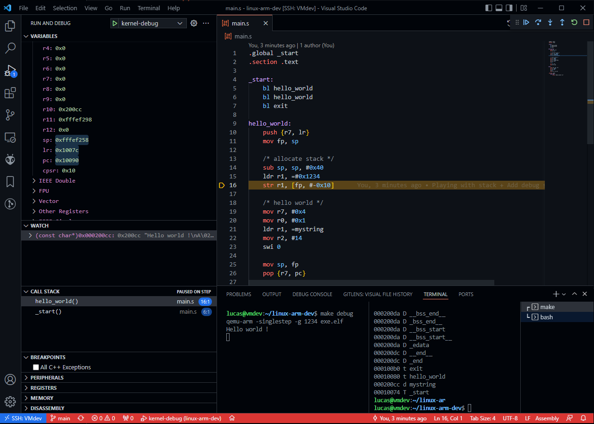

# Linux ARM developpement

- https://www.youtube.com/watch?v=FV6P5eRmMh8
- https://chromium.googlesource.com/chromiumos/docs/+/master/constants/syscalls.md#arm-32_bit_EABI
- https://www.youtube.com/watch?v=7fezHk7nmzY

Run with `make run`

Debug with `make debug` then `Ctrl + F5`

